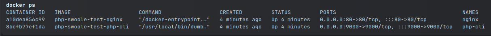
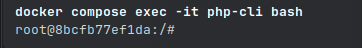
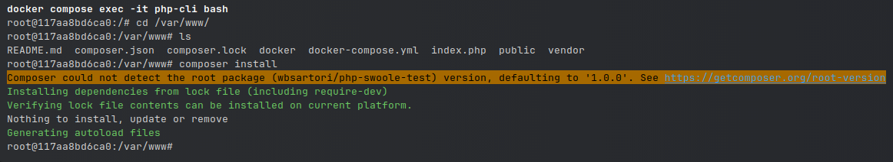
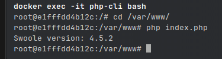

# PHP SWOOLE TEST

---

### Install

```bash
docker compose up -d --build
```

### View the created containers
```bash
docker container ps
```



---

### Access image php-cli


```bash
docker compose exec -it php-cli bash
```


---

### Access image nginx

```bash
docker compose exec -it nginx bash
```


---

### Install php dependencies

#### Access image from php-cli
```bash
docker compose exec -it php-cli bash

#Execute
root@117aa8bd6ca0:/var/www# composer install
```


---

### Check installation

#### Access image from php-cli
```bash
docker compose exec -it php-cli bash

#Execute
root@117aa8bd6ca0:/var/www# php index.php
```
